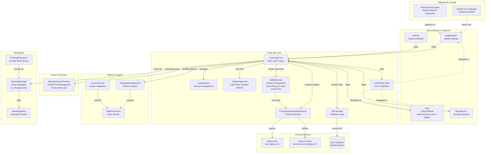

# Contributing Guide

[中文→](CONTRIBUTING_zh.md)

Thank you for your interest in contributing to FastLoginPlus! This guide covers
everything you need to build the project, follow its conventions, and submit a
pull request that passes CI on the first try.

FastLoginPlus is an actively maintained fork of
[FastLogin](https://github.com/TuxCoding/FastLogin) — a Minecraft server plugin
that automatically detects and logs in premium (paid) accounts on offline-mode
servers. If your change fixes a bug that also exists upstream, consider whether
it is upstream-worthy; the package name and artifact layout are intentionally
kept compatible.

You can contribute in many ways:

- **Code** — bug fixes, features, platform compatibility (Bukkit, Folia,
  BungeeCord, Velocity)
- **Translations** — add or extend `messages_<lang>.yml` files
- **Documentation** — README, login-flow docs, javadoc
- **Testing** — try release candidates on different server platforms, auth
  plugins, and Java versions, and report results

## Architectural overview



A detailed, source-verified description of the login decision flow lives in
[LOGIN-FLOW.md](docs/en/LOGIN-FLOW.md) — read it before touching `JoinManagement`,
listeners, or the proxy relay path.

## Project layout

| Module    | Java floor | Description                                                        |
|-----------|--------------|--------------------------------------------------------------------|
| `core`    | 8            | Shared library: login flow, storage, anti-bot, messaging, events   |
| `bukkit`  | 8            | Spigot/Paper plugin (ProtocolLib packet handling, auth-plugin hooks) |
| `folia`   | 21           | Folia plugin — **manual, hand-maintained copy of `bukkit`** adapted to regionized scheduling |
| `bungee`  | 17           | BungeeCord proxy plugin                                            |
| `velocity`| 17           | Velocity proxy plugin                                              |

The `Java floor` column is `ext.javaFloor` at the top of that module's `build.gradle`.
An artifact's
**runtime floor** — the lowest JRE that can *load* it — is the higher of that value
and the highest bytecode among the dependencies that get shaded into it, so a
dependency bump can raise a floor without touching this column. `META-INF/versions/N`
multi-release branches are add-ons for newer JREs and never count towards the floor.
Floors are unrelated to the build JDK below: the build runs on JDK 21 even though
`bungee`/`velocity` refuse to load on anything below 17.

### Adding a module

A module is three declarations: `include '<name>'` in `settings.gradle`, a
`build.gradle` in the new directory, and `ext.javaFloor` at the top of that file.
The build fails at configuration time when the floor is missing, so nothing is added
"for free" — and a floor that is too low fails `checkRuntimeBytecode` /
`verifyPluginJar` instead of shipping. Shared dependency versions belong in
`gradle/libs.versions.toml`, and a shaded or build-time dependency also needs an
entry in the Dependabot allow list (`.github/dependabot.yml`). A version that mirrors
what the user's proxy or server ships belongs in the `gradle/*.gradle` file that holds it
instead — Dependabot cannot rewrite those.

The `web` module (Javalin + Jackson, floor 17) is carried on its own branch and is not
part of the Gradle build yet — porting it means exactly those four steps.

Build requirements:

- **JDK 21** (the version pinned in `.java-version`, used by CI, and pinned as the Gradle
  toolchain) — this is a *build*
  requirement and says nothing about what the built artifacts need at runtime (see the
  `Java floor` column). The
  per-module `ext.javaFloor` values above are handed to javac as `--release`, which
  rejects APIs
  newer than each module's target, so a single modern JDK is all you need —
  but do not use Java-9+ APIs in `core`/`bukkit` or Java-18+ APIs in
  `bungee`/`velocity`. Note that `--release` only guards the APIs *you* compile
  against: it does not stop a newer dependency from silently raising the
  module's *runtime* requirement, which is what the bytecode-floor check below
  is for. That check exempts
  `module-info.class` (Guava 33+ ships exactly that at class-file 53 while every
  real class in it is still Java 8) — so a floor claim is verified by reading the
  bytecode: the highest class-file major version outside `META-INF/versions/`
  (52 = Java 8, 55 = 11, 61 = 17, 65 = 21), for the dependency JAR and for the
  built artifact.
- **Gradle 9.6.1** is supplied by the wrapper; no separate Gradle installation is
  needed. The build's toolchain needs a JDK 21: one that is installed is used
  automatically, and otherwise Gradle downloads one (the Foojay resolver declared in
  `settings.gradle`), so a bare clone builds without installing anything by hand. CI
  provides the JDK itself. A git clone is expected: the build embeds the commit hash in the final
  JAR name and manifest.

Some auth-plugin APIs (CrazyLogin, UltraAuth, BungeeAuth) are provided as
local JARs in the `lib/` directory of each module — no manual
installation is required.

## Building

```bash
# Build all modules, run tests and checks
./gradlew build

# Build all plugin JARs without tests
./gradlew assemble

# Run tests only
./gradlew test

# Build selected modules and their dependencies
./gradlew :bukkit:build :folia:build

# Collect four installable plugin JARs for release
./gradlew stageRelease

# Re-test against the oldest supported server SQLite driver
./gradlew :core:sqliteFloorTest
```

On Windows use `gradlew.bat` in place of `./gradlew`. Installable plugin JARs
land in each platform module's `build/libs/`, named like
`FastLoginPlusBukkit-<version>-<commit>.jar`. Files ending in `-plain.jar` are
unshaded intermediates; `stageRelease` collects only installable JARs in
`build/release/`. The project version lives in `build.gradle`; dependency versions
live in `gradle/libs.versions.toml`, except the deliberately pinned ones
(`gradle/*.gradle`, see below).

## Enforced checks — the build fails without these

These run with **`./gradlew build`** (locally and in CI). Save yourself a round-trip
and verify before pushing:

1. **MIT license header** — Java, XML and Gradle build files must carry the project
   license header (`checkLicenseHeaders`; resources are excluded).
   When creating a new file, copy the header from an existing one.
2. **Checkstyle** (`checkstyle.xml`, severity `error`; checks main Java sources).
   Highlights beyond the usual naming/whitespace rules:
   - Line length ≤ **120** characters (Java files)
   - Methods ≤ **160** lines; `final` parameters; no star imports; no unused
     imports; no tabs
   - `MagicNumber` is on — extract literals into named constants
   - `MissingSwitchDefault` — every `switch` needs a `default` branch
   - `DesignForExtension`, `FinalClass`, `HideUtilityClassConstructor` —
     design-for-inheritance rules; mark utility classes `final` with private
     constructors, and make classes `final` unless extension is intended
   - Javadoc: `@param`/`@return`/`@throws` required on documented methods;
     package-level javadoc (`JavadocPackage`) is checked
3. **Line endings and final newline** — `.gitattributes` normalizes all text
   files to LF and every file must end with a newline (`NewlineAtEndOfFile`).
   On Windows, let git handle conversion; do not commit CRLF.
4. **Per-module runtime bytecode floor** (`checkRuntimeBytecode` and
   `verifyPluginJar`, run by `check`) — every dependency shaded into a module must
   not be compiled for a newer Java version than that module's own
   `ext.javaFloor` (core/bukkit 8, bungee/velocity 17, folia 21).
   Without it a dependency bump can raise the module's runtime requirement with
   no build-time signal at all. Raising a floor is a deliberate decision:
   change `ext.javaFloor` in that module's `build.gradle`, and update this section and
   both readmes together. Test and `compileOnly` dependencies are excluded — test
   jars never reach a user, and provided APIs belong to the server or proxy.
5. **SQLite driver floor** (`:core:sqliteFloorTest`) — the storage tests are re-run against
   the oldest driver a user's server may ship, which is the only guard on that promise
   (bukkit/folia load the server's own driver). The floor exists twice on purpose:
   `gradle/sqlite-floor.gradle` says which jar the run swaps in, `PROMISED_FLOOR` in
   `SQLiteStorageTest` says what we promise — the test fails when they disagree, so raising
   the floor takes both edits (plus a note in the user-facing docs when it changes what users
   may run). The version sits in a `gradle/*.gradle` file, not the catalog, because the
   catalog is what Dependabot rewrites.

## Testing

- Tests use **JUnit 6** and **Mockito (inline mock maker — required for static
  mocks)**; both are declared in the root Gradle build. JUnit 6 raises the floor for
  *running* tests to **JDK 17+** — the pinned build JDK 21 already satisfies
  this, but `./gradlew test` will not start on anything older. Tests never ship,
  so no module's runtime floor changes with it.
- Unit tests live in each module's `src/test/java`; `bukkit` additionally has
  an `integration` test package.
- Add tests for bug fixes (a failing-test-first commit for non-trivial bugs is
  appreciated) and for new decision logic in `core`.
- If you touch packet handling or login flow, at minimum add/extend tests
  around the affected `core` logic — full cross-platform behavior needs manual
  testing, which you should describe in your PR (platforms, server versions,
  auth plugins tried).

## Platform-specific conventions

- **Folia mirrors Bukkit by hand.** `folia/src/main/java` contains a manual
  copy of the `bukkit` sources (same package `com.github.games647.fastlogin.bukkit`)
  with regionized-scheduler adaptations (`FoliaScheduler`). If your change
  applies to both platforms, port it to `folia/` yourself — CI will not remind
  you. Changes limited to scheduling-sensitive code should account for the
  two schedulers' different APIs.
- **Permissions** follow `fastloginplus.bukkit.command.*` (bukkit) and
  `fastloginplus.folia.command.*` (folia); they are resolved at build time
  from `${permissionPrefix}` in `plugin.yml`.
- **Language files** — user-facing messages live in
  `core/src/main/resources/messages_en.yml` and `messages_zh.yml`. New keys
  must be added to both; English is the fallback that auto-fills missing keys.
  New translations are welcome: add `messages_<lang>.yml` with the same keys.
- **Config templates** — `config.yml` (backend servers) and `config-proxy.yml`
  (BungeeCord/Velocity, trimmed of backend-only keys) both exist on purpose.
  When adding a config option, decide which template(s) it belongs in and
  update both files as needed. Defaults shown to users come from these
  templates, not from code.
- **Shaded dependencies** — HikariCP, SLF4J, SnakeYAML, Gson, Guava, PaperLib
  and the BungeeCord config shim are relocated into the final JARs, but the set
  differs per module (see the Shadow configuration): `bukkit` relocates all of
  them, `folia` is `bukkit` minus PaperLib, `bungee` relocates only HikariCP +
  SLF4J, and `velocity` relocates HikariCP + the config shim + SnakeYAML +
  the bundled MariaDB driver. Both proxies use their own Gson; BungeeCord
  also provides SnakeYAML. `sqlite-jdbc`/`mariadb` are
  `compileOnly` in `core`/`bukkit` (the server ships them) but bundled in
  `bungee`/`velocity`. Keep this in mind
  when adding dependencies — prefer a `compileOnly` dependency for anything a modern
  server already provides.
- **Dependency updates** — versions live in `gradle/libs.versions.toml` and
  `.github/dependabot.yml` is an *allow* list: only the
  dependencies named there are followed automatically (the shaded libraries, the
  build tooling and the test dependencies). Platform APIs (`paper-api`,
  `folia-api`, `velocity-api`, `bungeecord-*`), other plugins' hook APIs
  (ProtocolLib, AuthMe, SkinsRestorer, PlaceholderAPI, Geyser/Floodgate, ...),
  the JARs checked into `*/lib` and the shared Netty version are pinned on
  purpose — the version that decides at runtime is the user's server or plugin,
  not ours. So when you add a library that gets shaded into a JAR, or a build
  plugin, add it to `allow` in that file too, otherwise it will never be updated.
  The allow list matches a whole artifact, so it cannot say "update the shaded copy, never
  the copy that mirrors the user's proxy": the pinned side of `guava`/`gson`/`slf4j-api` and
  `sqlite-jdbc` lives in `gradle/proxy-baseline.gradle` and `gradle/sqlite-floor.gradle`.
  Moving such a version back into the catalog or a module `build.gradle` makes Dependabot
  propose raising it again; the test beside it still fails on drift either way.

## Commit messages

The project follows **Conventional Commits** style:

```
<type>(<optional scope>): <short summary in lowercase>
```

Types seen in history: `feat`, `fix`, `docs`, `test`, `chore`, `build`,
`version`.
Useful scopes: module names (`bukkit`, `folia`, `bungee`, `velocity`, `core`),
or areas (`storage`, `proxy-msg`, `config`, `changelog`).

## Pull requests

1. Fork the repository and create a feature branch off `main`.
2. Run `./gradlew build` locally — all checks above must pass.
3. Open the PR against `main` using the provided
   [PR template](.github/pull_request_template.md): a clear summary of the
   change and a reference to the related issue (`Fixes #123`).
4. If the work is still in progress, open a **draft PR** rather than waiting.
5. CI builds every push/PR to `main` and runs a CodeQL security scan on the
   result — green CI is required before merge.
6. For user-visible changes, add an entry to [CHANGELOG.md](CHANGELOG.md)
   under the current development version.
7. If your change affects user-facing setup or behavior described in the
   README, update both [README.md](README.md) and
   [README_zh.md](README_zh.md) — the two are kept in sync.

## Reporting bugs

When opening an issue, include:

- FastLoginPlus version (and where you got it from)
- Server platform and version (Paper/Spigot/Folia/BungeeCord/Velocity)
- Auth plugin (name + version), and whether a proxy is involved
- Relevant log excerpts (enable debug output if asked — `debug: true` in the
  config) and your `config.yml` with secrets removed
- For login issues: whether the account is premium, and what the player sees

## Additional developer documentation

- [LOGIN-FLOW.md](docs/en/LOGIN-FLOW.md) — the full login decision tree, verified
  against the source
- [PROTOCOLLIB-ASYNC-DESIGN.md](docs/en/PROTOCOLLIB-ASYNC-DESIGN.md) — why the packet
  listener is async and which races are compensated; read before changing
  ProtocolLib listener code
- [CRAFTAPI-BASELINE.md](docs/en/CRAFTAPI-BASELINE.md) — the baseline record of the
  vendored `craftapi/` module: what changed locally, what must not change silently,
  and how to update it

These documents are canonical in English under `docs/en/`; `docs/zh/` holds the
Chinese translations of the same files (keep both in sync when editing). This
guide itself is bilingual as well: [CONTRIBUTING_zh.md](CONTRIBUTING_zh.md).

## License

By contributing, you agree that your contributions will be licensed under the
project's [MIT License](LICENSE).
