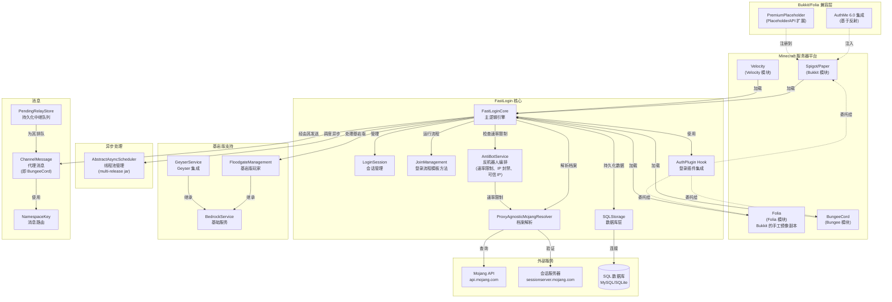

# 贡献指南

[English→](CONTRIBUTING.md)

感谢你有兴趣为 FastLoginPlus 做贡献! 本文覆盖了构建项目、遵守约定、以及提交一个首次就能通过 CI 的 Pull Request 所需的全部内容.

FastLoginPlus 是 [FastLogin](https://github.com/TuxCoding/FastLogin) 的活跃维护分支 —— 一个在离线模式服务器上自动检测并登录正版(付费)账号的 Minecraft 服务器插件. 如果你的改动修的是一个上游同样存在的 bug, 请考虑它是否也值得提给上游; 包名与 artifact 布局是有意保持兼容的.

你可以从很多方向参与:

- **代码** —— bug 修复、新功能、平台兼容(Bukkit、Folia、BungeeCord、Velocity)
- **翻译** —— 新增或扩充 `messages_<lang>.yml`
- **文档** —— README、登录流程文档、javadoc
- **测试** —— 在不同的服务器平台、登录插件与 Java 版本上试用候选版本并反馈结果

## 架构总览



登录决策流程的详细、经源码核对的说明在
[LOGIN-FLOW.md](docs/en/LOGIN-FLOW.md) —— 动 `JoinManagement`、监听器或代理中继路径之前请先读它.

## 项目结构

| 模块      | Java floor | 说明                                                              |
|-----------|--------------|-------------------------------------------------------------------|
| `core`    | 8            | 共享库: 登录流程、存储、反机器人、消息、事件                        |
| `bukkit`  | 8            | Spigot/Paper 插件(ProtocolLib 数据包处理、登录插件钩子)             |
| `folia`   | 21           | Folia 插件 —— **`bukkit` 的手工维护副本**, 适配区域化调度           |
| `bungee`  | 17           | BungeeCord 代理插件                                                |
| `velocity`| 17           | Velocity 代理插件                                                  |

`Java floor` 这一列就是该模块的 `maven.compiler.release`. 而产物的**运行时 floor**
—— 能*加载*它的最低 JRE —— 取"这个值"与"被 shade 进来的依赖中最高的字节码"两者中更高的那个,
所以依赖升级可以在不动这一列的情况下抬高 floor. `META-INF/versions/N` 多版本分支是给更高 JRE 的
附加实现, 永远不计入 floor. floor 与下面的构建 JDK 无关: 构建跑在 JDK 21 上, 而
`bungee`/`velocity` 的产物在 17 以下的 JRE 上根本加载不了.

构建要求:

- **JDK 21**(写在 `.java-version` 里、CI 使用的版本) —— 这是**构建**要求, 与产物运行时需要什么无关(见上表 `Java floor`). 上表各模块的 `maven.compiler.release` 会让 javac 拒绝比该模块目标更新的 API, 所以你只需要一个现代 JDK —— 但不要在 `core`/`bukkit` 里用 Java 9+ 的 API, 也不要在 `bungee`/`velocity` 里用 Java 18+ 的 API. 注意 `--release` 只约束*你自己*编译时用到的 API: 它无法阻止更新的依赖悄悄抬高模块的*运行时*要求, 下面那条字节码地板检查就是为此存在的. 但那条检查本身也不够 —— `enforceBytecodeVersion` 豁免 `module-info.class`(Guava 33+ 正好就带一个 class 53 的 module-info, 而它真正的类全是 Java 8) —— 所以 floor 的结论要用字节码来验证: 取 `META-INF/versions/` **之外**最高的 class 文件主版本号(52 = Java 8, 55 = 11, 61 = 17, 65 = 21), 依赖 JAR 与最终产物都要看.
- **Maven 3.9.0+**(`git-commit-id-maven-plugin` 10 在 Maven 3.6.3 EOL 后不再支持它, 因此提高下限; 开发时使用 3.9.x). 需要是 git clone —— 构建会把 commit hash 写进最终 JAR 的文件名与 manifest.

部分登录插件的 API(CrazyLogin、UltraAuth、BungeeAuth)以 system 作用域的 JAR 放在各模块的 `lib/` 目录里 —— 不需要手动安装.

## 构建

```bash
# 构建全部模块, 跳过测试
mvn package --batch-mode -DskipTests

# 构建并运行测试套件(CI 就是这么做的)
mvn package --batch-mode

# 只跑测试
mvn test --batch-mode

# 构建单个模块(连同其依赖, 这里以 core 为例)
mvn package -pl bukkit -am --batch-mode -DskipTests
mvn package -pl folia -am --batch-mode -DskipTests
```

产出的 JAR 落在各模块的 `target/` 目录下, 命名形如
`FastLoginPlusBukkit-<version>-<commit>`(模块名 + revision + commit hash).

## 强制检查 —— 不满足则构建失败

这些检查在**每一次**构建(本地与 CI)都会跑. 与其等 CI 回你一轮, 不如推之前先自己跑一遍:

1. **MIT 许可证头** —— 每个 Java 与 XML 文件都必须带项目许可证头(`license-maven-plugin`, 对着根目录 `LICENSE` 校验; 资源文件与 `.java-version` 被排除). 新建文件时, 从已有文件里拷贝头部.
2. **Checkstyle**(`checkstyle.xml`, severity 为 `error`, `failsOnError`).
   除常规命名/空白规则外, 重点还有:
   - 行长 ≤ **120** 字符(Java 文件)
   - 方法 ≤ **160** 行; 参数必须 `final`; 禁止星号导入; 禁止未使用的导入; 禁止 tab
   - `MagicNumber` 是开启的 —— 把字面量提取成具名常量
   - `MissingSwitchDefault` —— 每个 `switch` 都要有 `default` 分支
   - `DesignForExtension`、`FinalClass`、`HideUtilityClassConstructor` —— 面向继承的设计规则; 工具类标记 `final` 并写私有构造器; 除非有意允许继承, 否则类要 `final`
   - Javadoc: 被文档化的方法必须有 `@param`/`@return`/`@throws`; 包级 javadoc(`JavadocPackage`)也会检查
3. **换行符与文件末尾换行** —— `.gitattributes` 把所有文本文件规范为 LF, 且每个文件必须以换行结尾(`NewlineAtEndOfFile`). 在 Windows 上交给 git 转换; 不要提交 CRLF.
4. **每模块的运行时字节码地板**(`enforceBytecodeVersion`, 根 `pom.xml`, 在 `validate` 阶段运行) —— 任何被 shade 进某模块的依赖, 其编译目标都不得高于该模块自身的 `maven.compiler.release`(core/bukkit 8, bungee/velocity 17, folia 21). 没有它, 一次依赖升级就可能在毫无构建期信号的情况下抬高模块的运行时要求. 抬高地板是**有意决策**: 改该模块的 `maven.compiler.release`, 并同步更新本节与两个 readme. `test` 与 `provided` 作用域被排除 —— 测试 JAR 永远不会到达用户手里, provided 的那些属于服务器或代理.

## 测试

- 测试使用 **JUnit 6** 与 **Mockito(inline mock maker —— 静态 mock 必需)**; 两者都在根 POM 中声明. JUnit 6 把*运行*测试的下限抬到了 **JDK 17+** —— `.java-version` 钉住的构建 JDK 21 已满足, 但更低的 JDK 上 `mvn test` 无法启动. 测试是 `test` 作用域、不会随产物发布, 因此任何模块的运行时 floor 都不受影响.
- 单元测试位于各模块的 `src/test/java`; `bukkit` 另有一个 `integration` 测试包.
- 修 bug 请补测试(非平凡 bug 建议先写一个失败的测试再提交), `core` 中新的决策逻辑也要补测试.
- 如果你改的是数据包处理或登录流程, 至少要为受影响的 `core` 逻辑新增/扩充测试 —— 完整的跨平台行为需要人工验证, 请在 PR 里描述你验证的方式(用到的平台、服务器版本、登录插件).

## 平台相关约定

- **Folia 是 Bukkit 的手工镜像.** `folia/src/main/java` 里是 `bukkit` 源码的手工副本(同一个包 `com.github.games647.fastlogin.bukkit`), 只是适配了区域化调度器(`FoliaScheduler`). 如果你的改动对两个平台都适用, 请自己把它移植到 `folia/` —— CI 不会提醒你. 只涉及调度敏感代码的改动, 要照顾两个调度器不同的 API.
- **权限**遵循 `fastloginplus.bukkit.command.*`(bukkit)与 `fastloginplus.folia.command.*`(folia); 它们在构建期由 `plugin.yml` 里的 `${project.artifactId}` 解析出来.
- **语言文件** —— 面向用户的消息在
  `core/src/main/resources/messages_en.yml` 与 `messages_zh.yml`. 新增的键必须同时加到两者; 英文是自动补齐缺失键的兜底. 欢迎新增翻译: 加一个键名相同的 `messages_<lang>.yml` 即可.
- **配置模板** —— `config.yml`(后端服务器)与 `config-proxy.yml`
  (BungeeCord/Velocity, 裁掉了后端专属键)两者并存是有意为之.
  新增配置项时, 先决定它属于哪个(哪些)模板, 再按需更新这两个文件. 展示给用户的默认值来自这些模板, 而不是代码.
- **被 shade 的依赖** —— HikariCP、SLF4J、SnakeYAML、Gson、Guava、PaperLib 以及 BungeeCord 的 config shim 都会被 relocate 进最终 JAR, 但每个模块的集合不同(见各 shade-plugin 配置): `bukkit` 全部 relocate, `folia` = `bukkit` 减去 PaperLib, `bungee` 只 relocate HikariCP + SLF4J, `velocity` relocate HikariCP + config shim + SnakeYAML + 内置的 MariaDB 驱动. 两种代理都使用自身提供的 Gson; BungeeCord 还提供 SnakeYAML. `sqlite-jdbc`/`mariadb` 在 `core`/`bukkit` 里是 `provided`(服务器自带), 在 `bungee`/`velocity` 里则被内置. 加依赖时请记住这些 —— 现代服务器已经提供的东西优先用 `provided` 作用域.
- **依赖更新** —— `.github/dependabot.yml` 是**白名单**: 只有里面列出的依赖会被自动跟进(被 shade 的库、构建工具、测试依赖). 平台 API(`paper-api`、`folia-api`、`velocity-api`、`bungeecord-*`)、其他插件的 hook API(ProtocolLib、AuthMe、SkinsRestorer、PlaceholderAPI、Geyser/Floodgate 等)、`*/lib` 里检入的 JAR、以及共享的 `netty.version` 都是有意钉住的 —— 运行期真正生效的是用户的服务器/插件版本, 不是我们的. 因此新增会被 shade 进 JAR 的库或构建插件时, 请同时把条目加进该文件的 `allow`, 否则它会永远不被更新.

## 提交信息

项目遵循 **Conventional Commits** 风格:

```
<type>(<可选 scope>): <小写的简短摘要>
```

历史中出现过的 type: `feat`、`fix`、`docs`、`test`、`chore`、`build`、
`version`.
常用的 scope: 模块名(`bukkit`、`folia`、`bungee`、`velocity`、`core`), 或者领域名(`storage`、`proxy-msg`、`config`、`changelog`).

## Pull Request

1. Fork 仓库, 从 `main` 切出功能分支.
2. 本地跑 `mvn package --batch-mode` —— 上面所有检查都必须通过.
3. 用仓库提供的 [PR 模板](.github/pull_request_template.md) 向 `main` 开 PR: 清晰的改动摘要, 并引用相关 issue(`Fixes #123`).
4. 如果工作还没做完, 直接开 **draft PR**, 不必等.
5. CI 会对每个推送到 `main` 的提交/PR 做构建, 并对产物跑一次 CodeQL 安全扫描 —— 合并前 CI 必须是绿的.
6. 面向用户的改动, 请在 [CHANGELOG.md](CHANGELOG.md) 的当前开发版本下补一条.
7. 如果你的改动影响到 README 中描述的用户侧安装或行为, 请同时更新
   [README.md](README.md) 与 [README_zh.md](README_zh.md) —— 这两份是保持同步的.

## 报告问题

开 issue 时请附上:

- FastLoginPlus 版本(以及你是从哪里拿到的)
- 服务器平台与版本(Paper/Spigot/Folia/BungeeCord/Velocity)
- 登录插件(名称 + 版本), 以及是否涉及代理
- 相关日志片段(被要求时请开启调试输出 —— 配置里的 `debug: true`)以及去掉敏感信息后的 `config.yml`
- 如果是登录问题: 该账号是否正版, 以及玩家看到的是什么

## 其他开发者文档

- [LOGIN-FLOW.md](docs/en/LOGIN-FLOW.md) —— 完整的登录决策树, 已对照源码核对
- [PROTOCOLLIB-ASYNC-DESIGN.md](docs/en/PROTOCOLLIB-ASYNC-DESIGN.md) —— 数据包监听器为何是 async 的、补偿了哪些竞态; 改 ProtocolLib 监听器代码前必读
- [CRAFTAPI-BASELINE.md](docs/en/CRAFTAPI-BASELINE.md) —— 内化的 `craftapi/` 模块基线档案: 本地改了什么、什么不许静默改变、如何升级

这些文档以 `docs/en/` 下的英文版为权威; `docs/zh/` 是同一批文件的中文译文(编辑时请同步两边). 本指南本身也保持中英双语(英文原文见 [CONTRIBUTING.md](CONTRIBUTING.md)).

## 许可证

提交贡献即表示你同意你的贡献以项目的 [MIT 许可证](LICENSE) 授权.
