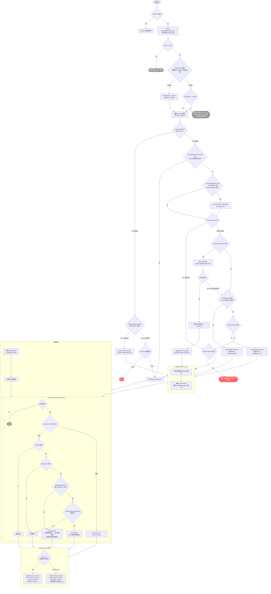

# FastLoginPlus 登录流程

## 概述

玩家连入服务器时，FastLoginPlus 按以下顺序判断：

1. **按名字查库** → 区分老玩家（有记录）和新玩家（无记录）
2. **老玩家** → 按上次登录方式（正版/离线）直接处理
3. **新玩家** → 查 Mojang API 判断是否正版，再按配置决定处理方式
4. **Mojang 握手通过后** → ForceLogin 管理器负责 auth 插件的注册/登录和写库

## 流程图

## 关键配置项与职责

| 配置项 | 职责 | 默认值 |
|---|---|---|
| `nameChangeCheck` | 查 Mojang API，通过 UUID 识别改名玩家并更新数据库旧记录 | false |
| `autoRegister` | 正版新玩家自动注册到 auth 插件（forceRegister） | false |
| `offline-whitelist` | 访问控制：放行正版玩家，踢出新离线玩家，老离线玩家正常进入 | false |
| `premiumUuid` | 正版玩家使用正版 UUID（而非离线 UUID） | false |
| `forwardSkin` | 转发正版皮肤给玩家 | true |
| `secondAttemptCracked` | 正版验证失败后记住该 IP+用户名，下次连接直接走离线 | false |
| `autoLogin` | 正版玩家自动登录 auth 插件（forceLogin/forceRegister） | true |

## requestPremiumLogin 的三次调用

`requestPremiumLogin` 在三个不同场景被调用，参数不同：

| 触发配置 | profile 参数 | registered | 效果 |
|---|---|---|---|
| `nameChangeCheck` | 按 UUID 查出的**旧记录**（保留历史数据） | false | 更新名字 + 注册到 auth 插件 |
| `autoRegister` | 按名字查出的**当前 profile**（可能是空壳） | false | 注册到 auth 插件 |
| `offline-whitelist` | 按名字查出的**当前 profile**（可能是空壳） | true | 只放行，不注册 |

`registered` 标志决定了 `ForceLoginManagement` 的行为：
- `registered=false` → `needsRegistration()=true` → `forceRegister()`（自动注册）
- `registered=true` → `needsRegistration()=false` → `forceLogin()`（自动登录）

## 数据库写入逻辑

`storage.save()` 根据 `rowId` 决定 SQL 操作：

| 场景 | rowId | SQL 操作 | UUID | Premium |
|---|---|---|---|---|
| 老正版玩家再登录 | ≥ 0 | UPDATE | 正版 UUID | true |
| 老离线玩家再登录 | ≥ 0 | UPDATE | null | false |
| 新正版玩家首次加入 | -1 | INSERT | 正版 UUID | true |
| 新离线玩家首次加入 | -1 | INSERT | null | false |
