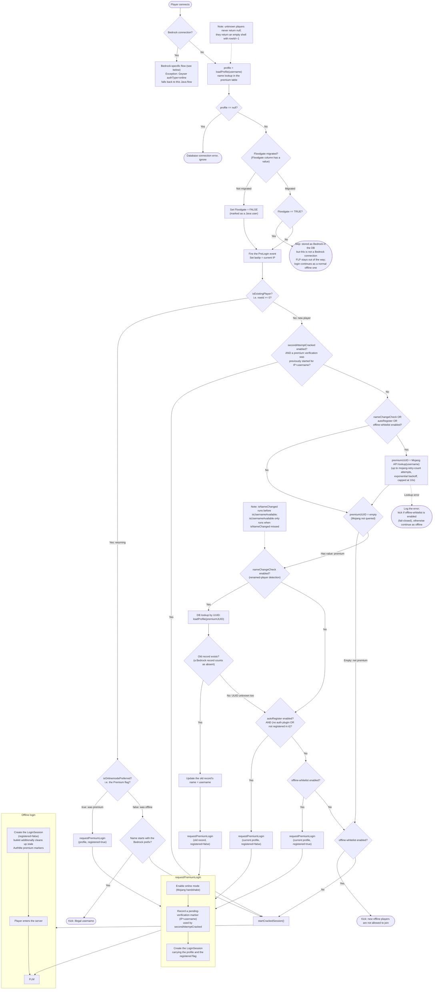
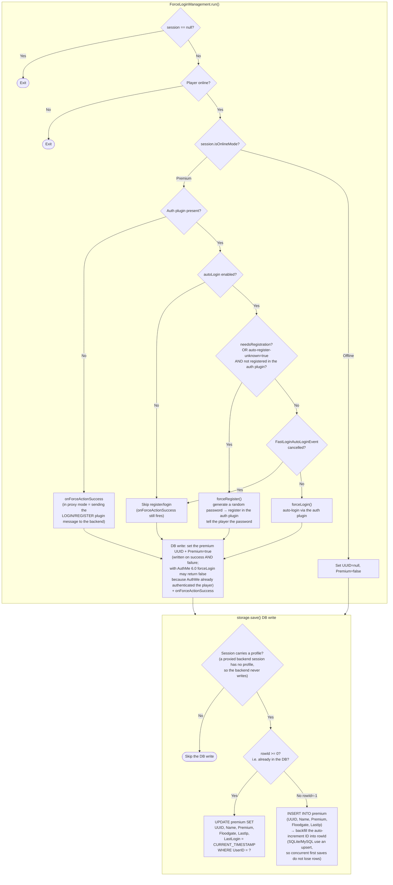
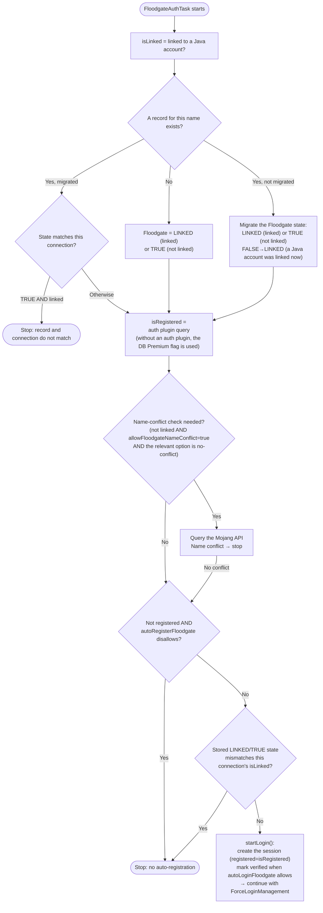
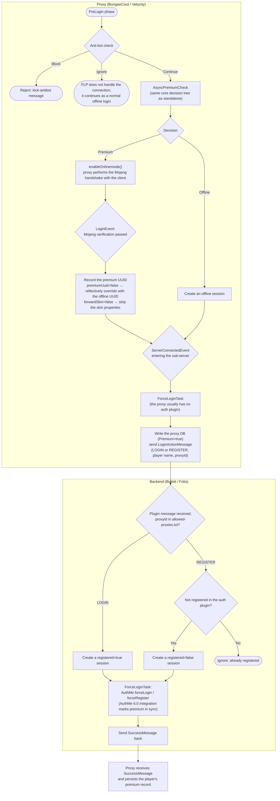

# FastLoginPlus Login Flow

## Overview

When a player connects, FastLoginPlus makes its decisions in this order:

1. **Anti-bot check** (packet entry point in standalone mode, PreLogin phase on a proxy; not performed on a proxied backend)
2. **Database lookup by name** → distinguishes returning players (record exists) from new players (no record)
3. **Returning player** → handled directly according to the last login mode (premium/offline)
4. **New player** → Mojang API query decides whether the account is premium, then config decides how to handle it
5. **After the Mojang handshake** → the ForceLogin manager performs auth-plugin registration/login and writes the database

This document has four parts:

- **Main flow** (standalone backend mode, bukkit/folia, ProtocolLib path) — the core decision tree shared by all platforms, defined by the `JoinManagement` template method in core
- **Bedrock (Geyser/Floodgate) flow** — Bedrock players skip the main decision tree
- **Proxy mode** (BungeeCord / Velocity + backend) — decisions and DB writes happen on the proxy; the backend only executes auth actions
- **Commands and Anti-bot** — manual player-state changes and connection admission

## Main Flow

```mermaid
flowchart TD
    A([Player connects]) --> B{Bedrock connection?}
    B -->|Yes| BR["Bedrock-specific flow (see below)<br/>Exception: Geyser authType=online<br/>falls back to this Java flow"]
    B -->|No| D["profile = loadProfile(username)<br/>name lookup in the premium table"]

    D --> E{profile == null?}
    E -->|Yes| ERR([Database connection error, ignore])
    E -->|No| G{"Floodgate migrated?<br/>(Floodgate column has a value)"}

    G -->|Not migrated| J["Set Floodgate = FALSE<br/>(marked as a Java user)"]
    Dsw2["Note: unknown players never return null;<br/>they return an empty shell with rowId=-1"] -.-> D
    J --> K
    G -->|Migrated| H{Floodgate == TRUE?}
    H -->|Yes| SKIP([Skip: stored as Bedrock in the DB<br/>but this is not a Bedrock connection<br/>FLP stays out of the way;<br/>login continues as a normal offline one])
    H -->|No| K

    K["Fire the PreLogin event<br/>Set lastIp = current IP"] --> L{"isExistingPlayer?<br/>i.e. rowId >= 0?"}

    %% ===== Returning players =====
    L -->|Yes: returning| M{"isOnlinemodePreferred?<br/>i.e. the Premium flag?"}
    M -->|true: was premium| N["requestPremiumLogin<br/>(profile, registered=true)"]
    M -->|false: was offline| O{Name starts with the Bedrock prefix?}
    O -->|Yes| P([Kick: illegal username])
    O -->|No| Q["startCrackedSession()"]

    %% ===== New players =====
    L -->|No: new player| R{"secondAttemptCracked enabled?<br/>AND a premium verification was<br/>previously started for IP+username?"}
    R -->|Yes| Q
    R -->|No| S{"nameChangeCheck OR<br/>autoRegister OR<br/>offline-whitelist enabled?"}

    S -->|No| W{"premiumUUID = empty<br/>(Mojang not queried)"}
    S -->|Yes| U["premiumUUID = Mojang API lookup(username)<br/>(up to mojang-retry-count attempts,<br/>exponential backoff, capped at 10s)"]
    U --> W
    U -.->|Lookup error| UX(["Log the error;<br/>kick if offline-whitelist is enabled<br/>(fail-closed), otherwise continue as offline"])

    W -->|Empty: not premium| W1{"offline-whitelist enabled?"}
    W1 -->|Yes| KICK([Kick: new offline players are not allowed to join])
    W1 -->|No| Q

    %% ===== Premium handling =====
    W -->|Has value: premium| Z{"nameChangeCheck enabled?<br/>(renamed-player detection)"}
    Z -->|Yes| Z1["DB lookup by UUID:<br/>loadProfile(premiumUUID)"]
    Z1 --> Z2{"Old record exists?<br/>(a Bedrock record counts as absent)"}
    Z2 -->|Yes| Z3["Update the old record's name = username"]
    Z3 --> Z4["requestPremiumLogin<br/>(old record, registered=false)"]
    Z2 -->|No: UUID unknown too| AA
    Z -->|No| AA
    eYG2["Note: isNameChanged runs before isUsernameAvailable;<br/>isUsernameAvailable only runs when isNameChanged missed"] -.-> Z

    AA{"autoRegister enabled?<br/>AND (no auth plugin OR not registered in it)?"}
    AA -->|Yes| AB["requestPremiumLogin<br/>(current profile, registered=false)"]
    AA -->|No| AC{"offline-whitelist enabled?"}
    AC -->|Yes| AD["requestPremiumLogin<br/>(current profile, registered=true)"]
    AC -->|No| W1

    %% ===== requestPremiumLogin =====
    N --> FL
    Z4 --> FL
    AB --> FL
    AD --> FL

    subgraph FL ["requestPremiumLogin"]
        direction TB
        F1["Enable online mode (Mojang handshake)"]
        F1 --> F2["Record a pending-verification marker (IP+username)<br/>used by secondAttemptCracked"]
        F2 --> F3["Create the LoginSession<br/>carrying the profile and the registered flag"]
    end

    FL --> FLM

    %% ===== Offline login =====
    Q --> QLM

    subgraph QLM ["Offline login"]
        direction TB
        Q1["Create the LoginSession<br/>(registered=false)<br/>bukkit additionally cleans up stale<br/>AuthMe premium markers"]
        Q1 --> Q2["Player enters the server"]
        Q2 --> FLM
    end
```

Notes:

- `loadProfile(name)` returns `null` only on a SQL error; unknown players get an empty shell with `rowId = -1` (`isExistingPlayer() == false`), so branch `E` is almost never taken.
- The whole load-to-session window (returning-player branch) runs inside a **name-level striped lock**, so concurrent logins, admin commands and plugin-message saves for the same name cannot interleave (since 0.5.0).
- The `secondAttemptCracked` marker is written when the premium verification **starts** (IP+username) and is **single-use**: the next connection that is still treated as a new player consumes it and goes straight offline.
- `requestPremiumLogin` and `startCrackedSession` are platform implementations: bukkit/folia cancel the original START packet via ProtocolLib and inject the online-mode handshake (the ProtocolSupport path is similar); on a proxy `enableOnlinemode()` makes the proxy perform the handshake with the client.

## ForceLoginManagement.run() (session execution phase)

After a session is created, the unified login management runs at the right time:

- **bukkit/folia standalone**: ~10 ticks after `PlayerJoinEvent` (so auth plugins can initialize the player) → `ForceLoginTask`
- **Proxy side**: `ServerConnectedEvent` (entering the sub-server) → `ForceLoginTask`
- **Proxied backend**: immediately after receiving the proxy's `LoginActionMessage` (or once the join event has fired) → `ForceLoginTask`

```mermaid
flowchart TD
    subgraph FLM ["ForceLoginManagement.run()"]
        direction TB
        G0{session == null?}
        G0 -->|Yes| G0X([Exit])
        G0 -->|No| G1{Player online?}
        G1 -->|No| G2([Exit])
        G1 -->|Yes| G3{session.isOnlineMode?}

        G3 -->|Premium| G4{Auth plugin present?}
        G4 -->|No| G5["onForceActionSuccess<br/>(in proxy mode = sending the<br/>LOGIN/REGISTER plugin message to the backend)"]
        G4 -->|Yes| G6{autoLogin enabled?}
        G6 -->|No| G7["Skip register/login<br/>(onForceActionSuccess still fires)"]
        G6 -->|Yes| G8{"needsRegistration?<br/>OR auto-register-unknown=true<br/>AND not registered in the auth plugin?"}
        G8 -->|Yes| G9["forceRegister()<br/>generate a random password → register in the auth plugin<br/>tell the player the password"]
        G8 -->|No| G10{"FastLoginAutoLoginEvent<br/>cancelled?"}
        G10 -->|Yes| G7
        G10 -->|No| G11["forceLogin()<br/>auto-login via the auth plugin"]

        G9 --> GSAVE
        G11 --> GSAVE
        G5 --> GSAVE
        G7 --> GSAVE
        GSAVE["DB write: set the premium UUID + Premium=true<br/>(written on success AND failure;<br/>with AuthMe 6.0 forceLogin may return false<br/>because AuthMe already authenticated the player)<br/>+ onForceActionSuccess"]

        G3 -->|Offline| G12["Set UUID=null, Premium=false"]
    end

    G12 --> SAVE
    GSAVE --> SAVE

    subgraph SAVE ["storage.save() DB write"]
        direction TB
        S0{"Session carries a profile?<br/>(a proxied backend session has no profile,<br/>so the backend never writes)"}
        S0 -->|No| S4([Skip the DB write])
        S0 -->|Yes| S1{"rowId >= 0?<br/>i.e. already in the DB?"}
        S1 -->|Yes| S2["UPDATE premium SET<br/>UUID, Name, Premium,<br/>Floodgate, LastIp,<br/>LastLogin = CURRENT_TIMESTAMP<br/>WHERE UserID = ?"]
        S1 -->|No rowId=-1| S3["INSERT INTO premium<br/>(UUID, Name, Premium,<br/>Floodgate, LastIp)<br/>→ backfill the auto-increment ID into rowId<br/>(SQLite/MySQL use an upsert,<br/>so concurrent first saves do not lose rows)"]
    end
```

## The Four requestPremiumLogin Call Sites

`requestPremiumLogin` is called from four different scenarios with different arguments:

| Trigger | profile argument | registered | Effect |
|---|---|---|---|
| Returning premium player (Premium=true) | The original DB record | true | Online-mode verification again, then auto-login |
| `nameChangeCheck` | The **old record** found by UUID (preserves history) | false | Update the name + register with the auth plugin |
| `autoRegister` | The **current profile** looked up by name (possibly an empty shell) | false | Register with the auth plugin |
| `offline-whitelist` | The **current profile** looked up by name (possibly an empty shell) | true | Admission only, no registration |

The `registered` flag drives `ForceLoginManagement`:
- `registered=false` → `needsRegistration()=true` → `forceRegister()` (auto-registration)
- `registered=true` → `needsRegistration()=false` → `forceLogin()` (auto-login)
- Exception: with `auto-register-unknown=true`, even `registered=true` sessions trigger a registration when the auth plugin does not know the player yet

## Bedrock (Floodgate / Geyser) Flow

Bedrock players **do not go through the Java decision tree above**. Handling has two phases:

1. **Connection decision phase** (at the top of `JoinManagement.onLogin`):
   - `FloodgateService.performChecks()`: name-conflict check according to `allowFloodgateNameConflict`, then **always takes over** the connection (returns true → the main flow ends)
   - `GeyserService.performChecks()` (plain Geyser without Floodgate): only falls back to the Java flow when Geyser's `authType=online` (Bedrock players already authenticated with Mojang are treated like premium Java players); otherwise it takes over too
   - If the player disconnects between the two phases, they are treated as having no Bedrock context and the checks are skipped
2. **Login execution phase** (after the player joins, the platform schedules `FloodgateAuthTask`, i.e. `FloodgateManagement.run()`):

```mermaid
flowchart TD
    R1([FloodgateAuthTask starts]) --> R2["isLinked = linked to a Java account?"]
    R2 --> R3{A record for this name exists?}
    R3 -->|No| R4["Floodgate = LINKED (linked)<br/>or TRUE (not linked)"]
    R3 -->|Yes, not migrated| R5["Migrate the Floodgate state:<br/>LINKED (linked) or TRUE (not linked)<br/>FALSE→LINKED (a Java account was linked now)"]
    R3 -->|Yes, migrated| R6{"State matches this connection?"}
    R6 -->|TRUE AND linked| R7([Stop: record and connection do not match])
    R6 -->|Otherwise| R8["isRegistered =<br/>auth plugin query<br/>(without an auth plugin, the DB Premium flag is used)"]
    R4 --> R8
    R5 --> R8
    R8 --> R9{"Name-conflict check needed?<br/>(not linked AND allowFloodgateNameConflict=true<br/>AND the relevant option is no-conflict)"}
    R9 -->|Yes| R10["Query the Mojang API<br/>Name conflict → stop"]
    R9 -->|No| R11
    R10 -->|No conflict| R11{"Not registered AND<br/>autoRegisterFloodgate disallows?"}
    R11 -->|Yes| R12([Stop: no auto-registration])
    R11 -->|No| R13{"Stored LINKED/TRUE state<br/>mismatches this connection's isLinked?"}
    R13 -->|Yes| R12
    R13 -->|No| R14["startLogin():<br/>create the session (registered=isRegistered)<br/>mark verified when autoLoginFloodgate allows<br/>→ continue with ForceLoginManagement"]
```

- Values for `autoLoginFloodgate` / `autoRegisterFloodgate`: `true` / `false` / `linked` (only linked Bedrock players) / `no-conflict` (only when the name does not clash with a premium Java account)
- Bedrock rows are written with an empty UUID (following the Floodgate row convention); the username is locked by the record

## Proxy Mode (BungeeCord / Velocity)

When `bungee: true` (spigot.yml) or Velocity forwarding is detected, FLP runs in a **proxy/backend split** architecture:

- **Proxy** = decision maker: anti-bot, Mojang queries, premium table reads/writes, the online-mode handshake with the client
- **Backend** = executor: only runs auth-plugin forceLogin / forceRegister and **never writes the DB** (its sessions carry no profile); the proxy DB is the single source of truth, and the backend's ProtocolLib listeners are not registered either

```mermaid
flowchart TD
    subgraph PROXY ["Proxy (BungeeCord / Velocity)"]
        P1([PreLogin phase]) --> P2{Anti-bot check}
        P2 -->|Block| P3([Reject: kick-antibot message])
        P2 -->|Ignore| P4([FLP does not handle the connection;<br/>it continues as a normal offline login])
        P2 -->|Continue| P5["AsyncPremiumCheck<br/>(same core decision tree as standalone)"]
        P5 --> P6{Decision}
        P6 -->|Premium| P7["enableOnlinemode()<br/>proxy performs the Mojang handshake with the client"]
        P6 -->|Offline| P8[Create an offline session]
        P7 --> P9{"LoginEvent:<br/>Mojang verification passed"}
        P9 --> P10["Record the premium UUID<br/>premiumUuid=false → reflectively override with the offline UUID<br/>forwardSkin=false → strip the skin properties"]
        P10 --> P11
        P8 --> P11{"ServerConnectedEvent<br/>entering the sub-server"}
        P11 --> P12["ForceLoginTask<br/>(the proxy usually has no auth plugin)"]
        P12 --> P13["Write the proxy DB (Premium=true)<br/>send LoginActionMessage<br/>(LOGIN or REGISTER, player name, proxyId)"]
    end

    subgraph BACKEND ["Backend (Bukkit / Folia)"]
        B1{"Plugin message received;<br/>proxyId in allowed-proxies.txt?"}
        B1 -->|LOGIN| B2["Create a registered=true session"]
        B1 -->|REGISTER| B3{"Not registered in the auth plugin?"}
        B3 -->|Yes| B4["Create a registered=false session"]
        B3 -->|No| B5([Ignore: already registered])
        B2 --> B6["ForceLoginTask:<br/>AuthMe forceLogin / forceRegister<br/>(AuthMe 6.0 integration marks premium in sync)"]
        B4 --> B6
        B6 --> B7["Send SuccessMessage back"]
    end

    P13 --> B1
    B7 --> P14["Proxy receives SuccessMessage<br/>and persists the player's premium record"]
```

Key points:

- `LoginActionMessage` travels on the plugin message channel `fastloginplus:force`; the `proxyId` is a UUID generated on the proxy's first start (Velocity stores it in `proxyId.txt`, BungeeCord uses its own `config.yml` `connection_uuid`); the backend validates it against `allowed-proxies.txt` to prevent forgery
- A REGISTER message is only executed after the backend confirms the player is unregistered; a LOGIN message runs the login directly
- The backend rejects unknown proxyIds and players marked as blocked (anti BungeeCord-ID brute force)
- In proxy mode, `/flp premium|cracked|delete` requests are forwarded from the backend to the proxy (see next section)

## Commands (/flp premium|cracked|delete)

On bukkit/folia: `/flp premium [player]`, `/flp cracked [player]`, `/flp delete [player]` (permission prefix `fastloginplus.bukkit.command.*` / `fastloginplus.folia.command.*`; acting on other players requires the `.other` suffix):

- **Standalone mode**: modifies the DB directly (premium ⇄ cracked / delete the record) and kicks the player so the change takes effect on reconnect; `/flp premium` is protected by the `premium-warning` confirmation
- **Proxy mode**: the backend performs the auth-plugin cleanup first (AuthMe lives on the backend), then forwards the toggle request to the proxy via a plugin message (which updates the proxy DB and kicks the player); the backend itself never touches the DB
  - If the target is offline and no online player can carry the message, the request goes into the persistent `pending-relay.json` queue and is re-sent when that player (or anyone) joins; the proxy replies with `ToggleFeedbackMessage` and the backend logs the result to the console
- The command is always registered as `/flp` (plugin.yml), so it never conflicts with the `/premium` namespace owned by AuthMe 6.0; the AuthMe 6.0 detection is only used for the runtime reflection integration

## Anti-bot

`AntiBotService.onIncomingConnection` runs these checks at the connection entry point, in priority order:

1. **Trusted IP** (`anti-bot.trusted-ips`) → allow
2. **Currently banned** (auto-ban after exceeding the per-IP limit, lasting `ban-duration`) → reject
3. **Global connection rate** (`connections` within the `expire` minute window) → reject
4. **Per-IP rate** (long window + burst window) → over-limit auto-bans the IP and rejects

The rejection action comes from `anti-bot.action`: `ignore` (FLP silently stops handling the connection; login continues as a normal offline login) / `block` (reject with the `kick-antibot` message). Third-party plugins can listen to `FastLoginAntiBotEvent` to override the decision.

Where it is mounted: standalone mode at the ProtocolLib / ProtocolSupport packet-listener entry; on the proxy at the PreLogin phase; **not at all on a proxied backend** (the proxy is responsible).

## Key Config Options

Defaults shown below are the current values from `core/src/main/resources/config.yml`:

| Option | Responsibility | Default |
|---|---|---|
| `nameChangeCheck` | Query the Mojang API, detect renamed players by UUID and update their old DB record | true |
| `autoRegister` | Auto-register new premium players with the auth plugin (forceRegister) | true |
| `autoLogin` | Auto-login premium players with the auth plugin (forceLogin) | true |
| `auto-register-unknown` | When a session says "login" but the auth plugin does not know the player, register them anyway | true |
| `offline-whitelist` | Access control: admit premium players, kick new offline players, let returning offline players join | false |
| `premiumUuid` | Premium players use their premium UUID (instead of the offline UUID) | true |
| `forwardSkin` | Forward the premium skin to the player (SkinsRestorer custom skins take priority) | true |
| `secondAttemptCracked` | New players whose premium verification did not complete join offline next time (single-use marker) | false |
| `mojang-retry-count` / `mojang-retry-delay` | Mojang API retry count on network failures / base backoff delay (exponential, capped at 10s) | 3 / 500 |
| `anti-bot.enabled` / `anti-bot.action` | Anti-bot switch / action when limits are hit (ignore/block) | true / ignore |
| `autoLoginFloodgate` / `autoRegisterFloodgate` / `allowFloodgateNameConflict` | Bedrock auto-login / auto-registration / name-conflict policy (true/false/linked/no-conflict) | false / false / false |
| `verifyClientKeys` / `respectIpLimit` | Standalone mode only (client public-key verification / auth-plugin per-IP registration limit) | false / false |

Note: `premiumUuid` points in the opposite direction on a standalone backend versus a proxy — a standalone backend is an offline-mode server, so `true` means **injecting** the premium UUID; a proxy naturally gets the premium UUID from online-mode verification, so `false` is what overrides it with the offline UUID.
