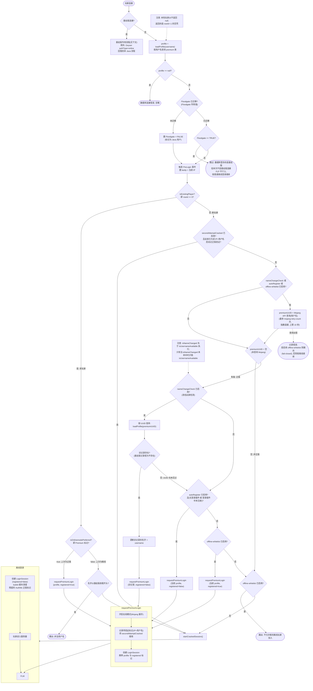
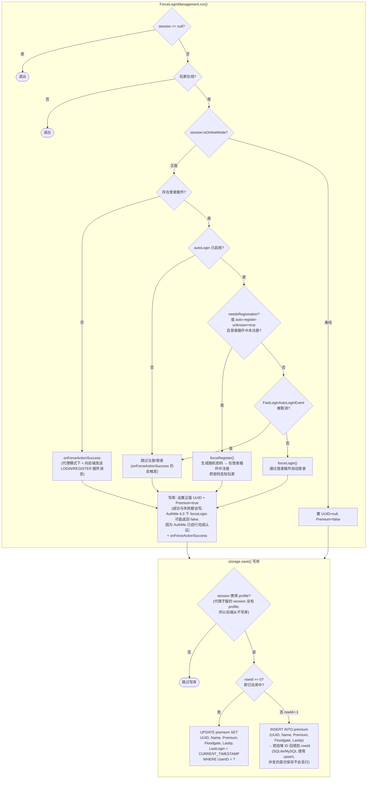
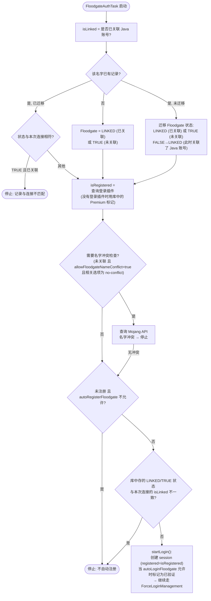
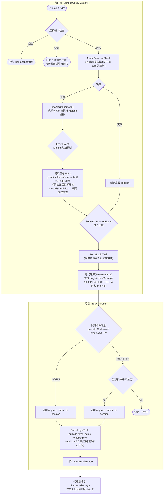

# FastLoginPlus 登录流程

[English→](../en/LOGIN-FLOW.md)

## 总览

玩家连接时, FastLoginPlus 按以下顺序做出判断:

1. **反机器人检查**(单端模式下在数据包入口点, 代理端在 PreLogin 阶段; 代理子服上不执行)
2. **按名字查数据库** → 区分老玩家(有记录)与新玩家(无记录)
3. **老玩家** → 直接按上次的登录模式(正版/离线)处理
4. **新玩家** → 由 Mojang API 查询决定账号是否正版, 再由配置决定如何处理
5. **Mojang 握手完成后** → ForceLogin 管理器执行登录插件的注册/登录并写入数据库

本文档分四部分:

- **主流程**(单端后端模式, bukkit/folia, ProtocolLib 路径)—— 所有平台共用的核心决策树, 由 core 中 `JoinManagement` 的模板方法定义
- **基岩版(Geyser/Floodgate)流程** —— 基岩版玩家跳过主决策树
- **代理模式**(BungeeCord / Velocity + 后端)—— 决策与数据库写入都发生在代理端; 后端只执行登录动作
- **命令与反机器人** —— 手动修改玩家状态与连接准入

## 主流程

说明:

- `loadProfile(name)` 只在 SQL 出错时返回 `null`; 未知玩家拿到的是 `rowId = -1` 的空壳(`isExistingPlayer() == false`), 所以分支 `E` 几乎不会走到.
- 从读库到建 session 的整个窗口(老玩家分支)都在**按名字的条带锁**内执行, 因此同一名字的并发登录、管理命令与插件消息保存不会交错(自 0.5.0 起).
- `secondAttemptCracked` 标记在正版验证**启动时**写入(IP+用户名), 且**只能用一次**: 下一次仍被判为新玩家的连接会消费它并直接走离线.
- `requestPremiumLogin` 与 `startCrackedSession` 是平台实现: bukkit/folia 通过 ProtocolLib 取消原始 START 包并注入在线模式握手(ProtocolSupport 路径类似); 代理端由 `enableOnlinemode()` 让代理与客户端完成握手.

## ForceLoginManagement.run()(session 执行阶段)

session 创建后, 统一的登录管理会在合适的时机运行:

- **bukkit/folia 单端**: `PlayerJoinEvent` 后约 10 tick(给登录插件初始化玩家的时间)→ `ForceLoginTask`
- **代理端**: `ServerConnectedEvent`(进入子服)→ `ForceLoginTask`
- **代理子服**: 收到代理的 `LoginActionMessage` 后立即(或等加入事件已触发后)→ `ForceLoginTask`

## requestPremiumLogin 的四个调用点

`requestPremiumLogin` 在四种场景下被调用, 参数各不相同:

| 触发场景 | profile 参数 | registered | 效果 |
|---|---|---|---|
| 老正版玩家(Premium=true) | 数据库中的原记录 | true | 再次进行在线模式验证, 然后自动登录 |
| `nameChangeCheck` | 按 UUID 找到的**旧记录**(保留历史) | false | 更新名字 + 在登录插件中注册 |
| `autoRegister` | 按名字查到的**当前 profile**(可能是空壳) | false | 在登录插件中注册 |
| `offline-whitelist` | 按名字查到的**当前 profile**(可能是空壳) | true | 仅做准入, 不注册 |

`registered` 标记驱动 `ForceLoginManagement`:
- `registered=false` → `needsRegistration()=true` → `forceRegister()`(自动注册)
- `registered=true` → `needsRegistration()=false` → `forceLogin()`(自动登录)
- 例外: 当 `auto-register-unknown=true` 时, 即使 `registered=true`, 只要登录插件还不认识该玩家, 也会触发注册

## 基岩版(Floodgate / Geyser)流程

基岩版玩家**不走上面的 Java 决策树**. 处理分两个阶段:

1. **连接决策阶段**(`JoinManagement.onLogin` 顶部):
   - `FloodgateService.performChecks()`: 按 `allowFloodgateNameConflict` 做名字冲突检查, 然后**总是接管**该连接(返回 true → 主流程结束)
   - `GeyserService.performChecks()`(没有 Floodgate 的纯 Geyser): 只有当 Geyser 的 `authType=online` 时才回落到 Java 流程(此时基岩版玩家已通过 Mojang 认证, 视同正版 Java 玩家); 否则同样接管
   - 如果玩家在两个阶段之间断线, 则视为没有基岩版上下文, 跳过这些检查
2. **登录执行阶段**(玩家加入后, 由平台调度 `FloodgateAuthTask`, 即 `FloodgateManagement.run()`):

- `autoLoginFloodgate` / `autoRegisterFloodgate` 的取值: `true` / `false` / `linked`(仅已关联的基岩版玩家) / `no-conflict`(仅当名字不与正版 Java 账号冲突时)
- 基岩版记录以空 UUID 写入(遵循 Floodgate 的行约定); 用户名被该记录锁定

## 代理模式(BungeeCord / Velocity)

当检测到 `bungee: true`(spigot.yml)或 Velocity 转发时, FLP 运行在**代理/后端分离**架构下:

- **代理端** = 决策方: 反机器人、Mojang 查询、premium 表的读写、与客户端的在线模式握手
- **后端** = 执行方: 只执行登录插件的 forceLogin / forceRegister, **从不写库**(其 session 不携带 profile); 代理端的数据库是唯一事实来源, 后端的 ProtocolLib 监听器也不会注册

要点:

- `LoginActionMessage` 走插件消息通道 `fastloginplus:force`; `proxyId` 是代理端首次启动时生成的 UUID(Velocity 存在 `proxyId.txt`, BungeeCord 使用其自身 `config.yml` 的 `stats` 值, 该文件由 BungeeCord 首次启动时生成); 后端用 `allowed-proxies.txt` 校验它以防伪造
- 该消息现在还携带代理端 `LoginEvent` 中验证过的 Mojang UUID(`LoginActionMessage.verifiedPremiumUuid`), 因此即使 `premiumUuid: false` 让连接 UUID 变成了离线 UUID, 后端仍能给 AuthMe 盖上 `premium_uuid`
- REGISTER 消息只在后端确认玩家未注册后才执行; LOGIN 消息直接执行登录
- 后端会拒绝未知 proxyId 以及被标记为 block 的玩家(防止暴力猜 BungeeCord ID)
- 代理模式下, `/flp premium|cracked|delete` 请求由后端转发到代理端(见下一节)
- 后端不必等消息才知道连接已通过验证: 自 0.7.0 起代理会把验证结果证明附在转发的 profile 上, Paper 后端在配置阶段就能读到(见下文*正版证明*)

### 正版证明

上面的插件消息中继是*兜底方案*. 代理端还会把已验证的 Mojang UUID 附加到它转发的 profile 上, 这样后端可以在 AuthMe 的 `HIGHEST` 优先级处理器运行、弹出阻塞式 preJoin 对话框**之前**就建好 AuthMe 记录:

| 情形 | 传输方式 | 后端如何识别 |
|---|---|---|
| `premiumUuid: false`(两种代理) | profile 属性: Velocity 现代转发用 `flp-premium-uuid`, BungeeCord 传统握手用 `flp_premium_uuid` | 该属性携带已验证的 Mojang UUID. BungeeCord 不能用带连字符的写法: Paper 会重建传统 profile, 并丢弃所有不匹配 `\w{0,16}` 的属性名 |
| `premiumUuid: true`(两种代理) | 转发的连接 UUID | 不附加属性; UUID 本身就是证明(v4 UUID 只可能来自代理 —— 离线 UUID 一定是 v3) |

后端的消费者:

- **Paper(含 Folia)**: `AsyncPlayerConnectionConfigureEvent` 处理器(`readForwardedPremiumUuid` → `resolveAttestedUuid` → `applyPremiumAtConfigure`)同步标记记录并关闭两个 preJoin 对话框; 没有证明时回落到异步 Mojang 查询
- **Spigot 与较老的 Paper**: 不存在配置阶段, 因此 `PreLoginPremiumListener` 在 `AsyncPlayerPreLoginEvent` 时调用 `applyPremiumAtPreLogin` —— 足以在加入之前预先建好记录

防护栏: 只有当同一次登录在 pre-login profile 上已经携带该证明时才生效(profile 缓存重放会被记录并忽略), 且管理员的 `/flp cracked` 优先于仍在途中的标记.

## 命令(/flp premium|cracked|delete)

在 bukkit/folia 上: `/flp premium [玩家]`、`/flp cracked [玩家]`、`/flp delete [玩家]`(权限前缀 `fastloginplus.bukkit.command.*` / `fastloginplus.folia.command.*`; 对他人操作需要 `.other` 后缀):

- **单端模式**: 直接改数据库(正版 ⇄ 离线 / 删除记录)并踢出玩家, 使改动在重连时生效; `/flp premium` 由 `premium-warning` 二次确认保护
- **代理模式**: 后端先做登录插件侧的清理(AuthMe 在后端), 再通过插件消息把切换请求转发给代理端(由代理更新数据库并踢出玩家); 后端自身从不碰数据库
  - 如果目标玩家离线、又没有在线玩家可以充当消息载体, 请求会进入持久化队列 `pending-relay.json`, 等该玩家(或任意玩家)加入时重发; 代理端用 `ToggleFeedbackMessage` 回复, 后端把结果打到控制台
  - 同一队列还承载第三类条目: AuthMe 自身的 `premium.set` / `premium.unset` 通知(`premiumNotices`)在没有载体在线时入队、稍后中继, 因为它们更新的是 AuthMe *代理侧*的正版缓存 —— 也就是决定 `forceOnlineMode()` 的东西 —— 而不是 FLP 自己的 profile
- 命令始终以 `/flp` 注册(plugin.yml), 从不别名到 `/premium`. AuthMe 6.0 自带的 `/premium` 与 `/freemium` 保持注册, 但在 FLP 接管正版处理时会被 `AuthMeCommandGuard` 拦截(提示玩家改用 `/flp`): 否则它们会在 FLP 背后改动 AuthMe 的正版状态. 门控接管的那套 AuthMe 6.0 检测同样门控这个守卫, 所以在 AuthMe 5.x 上两条命令照常工作
- 裸 `/flp` 打印版本与用法, 仅限服务器 OP; `prem`、`del`、`unpremium` 可作为子命令别名

## 反机器人

`AntiBotService.onIncomingConnection` 在连接入口点按优先级依次执行:

1. **可信 IP**(`anti-bot.trusted-ips`)→ 放行
2. **当前被封禁**(超出每 IP 限制后自动封禁, 持续 `ban-duration`)→ 拒绝
3. **全局连接速率**(`expire` 分钟窗口内的 `connections`)→ 拒绝
4. **每 IP 速率**(长窗口 + 突发窗口)→ 超限则自动封禁该 IP 并拒绝

拒绝动作由 `anti-bot.action` 决定: `ignore`(FLP 静默停止处理该连接; 登录按普通离线登录继续)/ `block`(用 `kick-antibot` 消息拒绝). 第三方插件可以监听 `FastLoginAntiBotEvent` 覆盖该决策.

挂载位置: 单端模式在 ProtocolLib / ProtocolSupport 的数据包监听入口; 代理端在 PreLogin 阶段; **代理子服上完全不挂载**(由代理端负责).

## 关键配置项

下表默认值取自 `core/src/main/resources/config.yml` 的当前值:

| 配置项 | 职责 | 默认值 |
|---|---|---|
| `nameChangeCheck` | 查询 Mojang API, 按 UUID 检测改名玩家并更新其旧记录 | true |
| `autoRegister` | 为新正版玩家在登录插件中自动注册(forceRegister) | true |
| `autoLogin` | 为老正版玩家在登录插件中自动登录(forceLogin) | true |
| `auto-register-unknown` | 当 session 说"登录"但登录插件不认识该玩家时, 仍然注册 | true |
| `offline-whitelist` | 准入控制: 放行正版玩家, 踢出新离线玩家, 允许老离线玩家进入 | false |
| `premiumUuid` | 正版玩家使用其正版 UUID(而非离线 UUID) | true |
| `forwardSkin` | 向玩家转发正版皮肤(SkinsRestorer 自定义皮肤优先) | true |
| `secondAttemptCracked` | 正版验证未完成的新玩家下次按离线加入(一次性标记) | false |
| `mojang-retry-count` / `mojang-retry-delay` | Mojang API 网络失败重试次数 / 退避基准延迟(指数增长, 上限 10 秒) | 3 / 500 |
| `anti-bot.enabled` / `anti-bot.action` | 反机器人开关 / 触发限制时的动作(ignore/block) | true / ignore |
| `autoLoginFloodgate` / `autoRegisterFloodgate` / `allowFloodgateNameConflict` | 基岩版自动登录 / 自动注册 / 名字冲突策略(true/false/linked/no-conflict) | false / false / false |
| `verifyClientKeys` / `respectIpLimit` | 仅单端模式(客户端公钥校验 / 登录插件的每 IP 注册限制) | false / false |

注意: `premiumUuid` 在单端后端与代理端语义相反 —— 单端后端本身就是离线模式服务器, 所以 `true` 表示**注入**正版 UUID; 代理端本来就通过在线模式验证拿到正版 UUID, 所以用 `false` 把它覆盖成离线 UUID.
